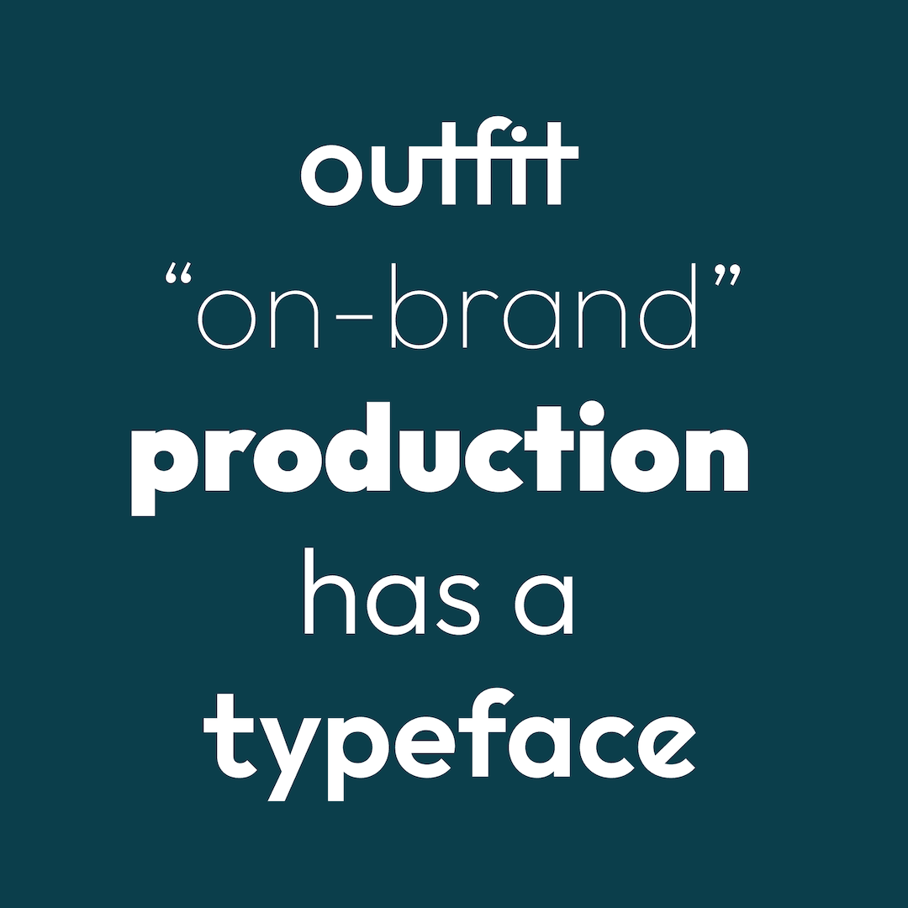

----

## Setting up your font

* **New repositories.** Hit the green button above ("Use this template") to create your own repository.\
&nbsp;&nbsp;*Make sure to click the checkbox marked "Include all branches".*

* **Updating a repository.** To update your font repository to bring in the latest best-practices from
our Unified Font Repository, run `make update-ufr` from the command line.

* Replace the font sources in the `sources` directory with your own fonts. These sources may be either in Glyphs format or UFO/Designspace formats.\
\
Unlike many open source distributors, Google Fonts is a **curated content**. Fonts shipped to the platform have to match the [Google Fonts Specifications](https://github.com/googlefonts/gf-docs/tree/main/Spec). Please read them carefully.\
\
*(The sample font provided in this template is [Rubik](https://github.com/googlefonts/rubik/) by Philipp Hubert, Sebastian Fischer, and contributors.)*

* Then reference the sources in the file `sources/config.yaml`, as well as making any other changes you would like to make based on the instructions in the [Google Font Builder documentation](https://github.com/googlefonts/gftools/blob/main/Lib/gftools/builder/__init__.py).

* Add yourself to the `AUTHORS.txt` and `CONTRIBUTORS.txt` files.

* Update the first line of the OFL.txt (year and project name). Update also the Copyright string in the sources, it has to be the same as the OFL.txt. The `.glyphs` file in this repo gives you required base charset and font info.

* Finally, add and commit any files you have modified (i.e. `README.md`, `AUTHORS.txt`, `CONTRIBUTORS.txt`, the font sources, and `sources/config.yaml`) to git, then push to GitHub.

* Once you are happy with your font, add promotional assets in the documentation directory. Make it different from the pic you use in this README. You can get inspired by existing tweet @googlefonts like: https://twitter.com/googlefonts/status/1415562928657416192.

* Remove this section from the readme. :-)
----

# My Font

[![][Fontbakery]](https://googlefonts.github.io/Unified-Font-Repository/fontbakery-report.html)
[![][Universal]](https://googlefonts.github.io/Unified-Font-Repository/fontbakery-report.html)
[![][GF Profile]](https://googlefonts.github.io/Unified-Font-Repository/fontbakery-report.html)
[![][Outline Correctness]](https://googlefonts.github.io/Unified-Font-Repository/fontbakery-report.html)
[![][Shaping]](https://googlefonts.github.io/Unified-Font-Repository/fontbakery-report.html)

[Fontbakery]: https://img.shields.io/endpoint?url=https%3A%2F%2Fraw.githubusercontent.com%2Fgooglefonts%2FUnified-Font-Repository%2Fgh-pages%2Fbadges%2Foverall.json
[GF Profile]: https://img.shields.io/endpoint?url=https%3A%2F%2Fraw.githubusercontent.com%2Fgooglefonts%2FUnified-Font-Repository%2Fgh-pages%2Fbadges%2FGoogleFonts.json
[Outline Correctness]: https://img.shields.io/endpoint?url=https%3A%2F%2Fraw.githubusercontent.com%2Fgooglefonts%2FUnified-Font-Repository%2Fgh-pages%2Fbadges%2FOutlineCorrectnessChecks.json
[Shaping]: https://img.shields.io/endpoint?url=https%3A%2F%2Fraw.githubusercontent.com%2Fgooglefonts%2FUnified-Font-Repository%2Fgh-pages%2Fbadges%2FShapingChecks.json
[Universal]: https://img.shields.io/endpoint?url=https%3A%2F%2Fraw.githubusercontent.com%2Fgooglefonts%2FUnified-Font-Repository%2Fgh-pages%2Fbadges%2FUniversal.json

Description of your font goes here. We recommend to start with a very short presentation line (the kind you would use on twitter to present your project for example), and then add as much details as necesary :-) Origin of the project, idea of usage, concept of creation… but also number of masters, axes, character sets, etc.

Don't hesitate to create images!

## About

Description of you and/or organisation goes here.

## Building

Fonts are built automatically by GitHub Actions - take a look in the "Actions" tab for the latest build.

If you want to build fonts manually on your own computer:

* `make build` will produce font files.
* `make test` will run [FontBakery](https://github.com/googlefonts/fontbakery)'s quality assurance tests.
* `make proof` will generate HTML proof files.

The proof files and QA tests are also available automatically via GitHub Actions - look at `https://yourname.github.io/your-font-repository-name`.

## Changelog

When you update your font (new version or new release), please report all notable changes here, with a date.
[Font Versioning](https://github.com/googlefonts/gf-docs/tree/main/Spec#font-versioning) is based on semver. 
Changelog example:

**26 May 2021. Version 2.13**
- MAJOR Font turned to a variable font.
- SIGNIFICANT New Stylistic sets added.

## License

This Font Software is licensed under the SIL Open Font License, Version 1.1.
This license is copied below, and is also available with a FAQ at
https://scripts.sil.org/OFL

## Repository Layout

This font repository structure is inspired by [Unified Font Repository v0.3](https://github.com/unified-font-repository/Unified-Font-Repository), modified for the Google Fonts workflow.
